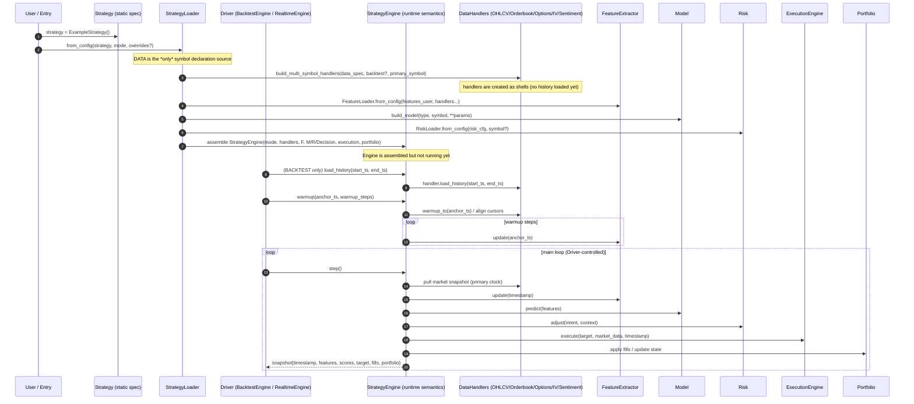
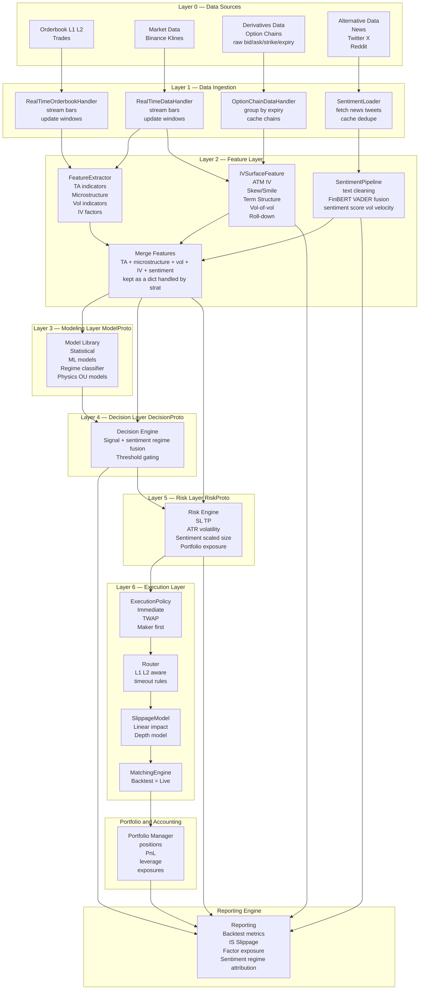

<h1 align="center">
  <strong>
    The Quant Engine (TradeBot v4)
  </strong>
</h1>

<p align="center" style="font-size:26px; font-weight:600; line-height:1.35; padding:10px 0;">
  A modular, extensible, execution-realistic research & trading framework —
  designed for professional-grade systematic trading.
</p>

---

# Overview
Quant Engine (TradeBot v4) is a **contract-driven quant research & execution framework** with **one unified runtime semantics** across:
- **Backtest**
- **Mock (paper) trading**
- **Live trading**

Core idea: components communicate through explicit contracts (Protocols), while the runtime enforces **time/lifecycle correctness** and **execution realism**.

**Design rules (non-negotiable):**
- **Strategy** = static specification (what to run). No mode, no time, no side effects.
- **Engine** = runtime semantics (time, lifecycle, legality).
- **Driver** (BacktestEngine / RealtimeEngine) = time pusher (calls `engine.step()`), strategy-agnostic.

## Event-driven → Contract-driven
Earlier versions chained logic directly (Data → Features → Model → Decision → Risk → Execution), which became fragile with multi-source data and execution realism.

v4 keeps the runtime event-driven, but **logic boundaries are enforced by contracts**:
- `FeatureChannel` → features
- `ModelProto` → scores
- `DecisionProto` → intents
- `RiskProto` → target positions
- `ExecutionPolicy/Router/Slippage/Matching` → fills

## Strategy loading and runtime control-flow

For a zoomable version of this diagram on GitHub, open **[loading-and-runtime-control-flow.pdf](loading-and-runtime-control-flow.pdf)**.



---

# How a Market Bar Flows Through the Quant Engine (v4)
At runtime, each new market bar triggers a clean, contract-driven pipeline:

1. Handlers provide the current market snapshot (multi-source)
2. Features are computed and merged into a single feature dict
3. Models output scores
4. Decision + Risk convert scores into a target position
5. Execution layer produces fills (same semantics across backtest/mock/live)
6. Portfolio + reporting update P&L / accounting / traces

Each layer depends **only on contracts**, not implementations.

---

# Minimal Strategy Configuration Example (v4 JSON)
This is the *runtime assembly config* consumed by `StrategyLoader.from_config(...)`. In practice your real strategies will have more features and data sources; the important part is the **shape** (and the naming convention).

```json
{
  "data": {
    "primary": {
      "ohlcv": { "symbol": "BTCUSDT", "tf": "15m" },
      "orderbook": { "symbol": "BTCUSDT", "depth": 20 }
    },
    "secondary": {
      "ETHUSDT": {
        "ohlcv": { "tf": "15m" }
      }
    }
  },
  "features_user": [
    { "name": "RSI_MODEL_BTCUSDT", "type": "RSI", "symbol": "BTCUSDT", "params": { "window": 14 } },
    { "name": "ATR_RISK_BTCUSDT", "type": "ATR", "symbol": "BTCUSDT", "params": { "window": 14 } }
  ],
  "model": {
    "type": "RSI_MODEL",
    "params": { "rsi_feature": "RSI_MODEL_BTCUSDT" }
  },
  "decision": {
    "type": "THRESHOLD",
    "params": { "threshold": 0.0 }
  },
  "risk": {
    "type": "ATR_SIZER",
    "params": { "risk_fraction": 0.02 }
  },
  "execution": {
    "type": "TWAP",
    "params": { "segments": 5 }
  }
}
```

Notes:
- **Symbols are declared only in `data`** (primary + secondary). Features/models may reference symbols but must not introduce new ones.
- Feature names follow: `TYPE_PURPOSE_SYMBOL` (and if there is a ref: `TYPE_PURPOSE_REF^SYMBOL`).

---

# Minimal Working Example (Python)
```python
from quant_engine.strategy.engine import EngineMode
from quant_engine.strategy.loader import StrategyLoader
from quant_engine.backtest.engine import BacktestEngine

# user-defined strategy: static spec only (no mode/time/side effects)
from strategies.example_strategy import ExampleStrategy

strategy = ExampleStrategy()

# assembly: Strategy + mode -> StrategyEngine (handlers are shells; no history loaded yet)
engine = StrategyLoader.from_config(strategy=strategy, mode=EngineMode.BACKTEST)

# driver: time pusher (strategy-agnostic)
BacktestEngine(
    engine,
    start_ts=1640995200.0,   # 2022-01-01 UTC
    end_ts=1672531200.0,     # 2023-01-01 UTC
    warmup_steps=200,
).run()
```

---

# Why This Architectural Shift Matters
It enables the Quant Engine to gracefully support:
- ML-based sentiment regimes
- microstructure-aware execution
- IV-surface-derived features (SABR / SSVI)
- volatility forecasting
- multi-asset & cross-asset strategies
- execution-realistic mock trading
- reproducible backtests with live parity
- research & execution decoupled but interoperable

---

# Full System Architecture Diagram

